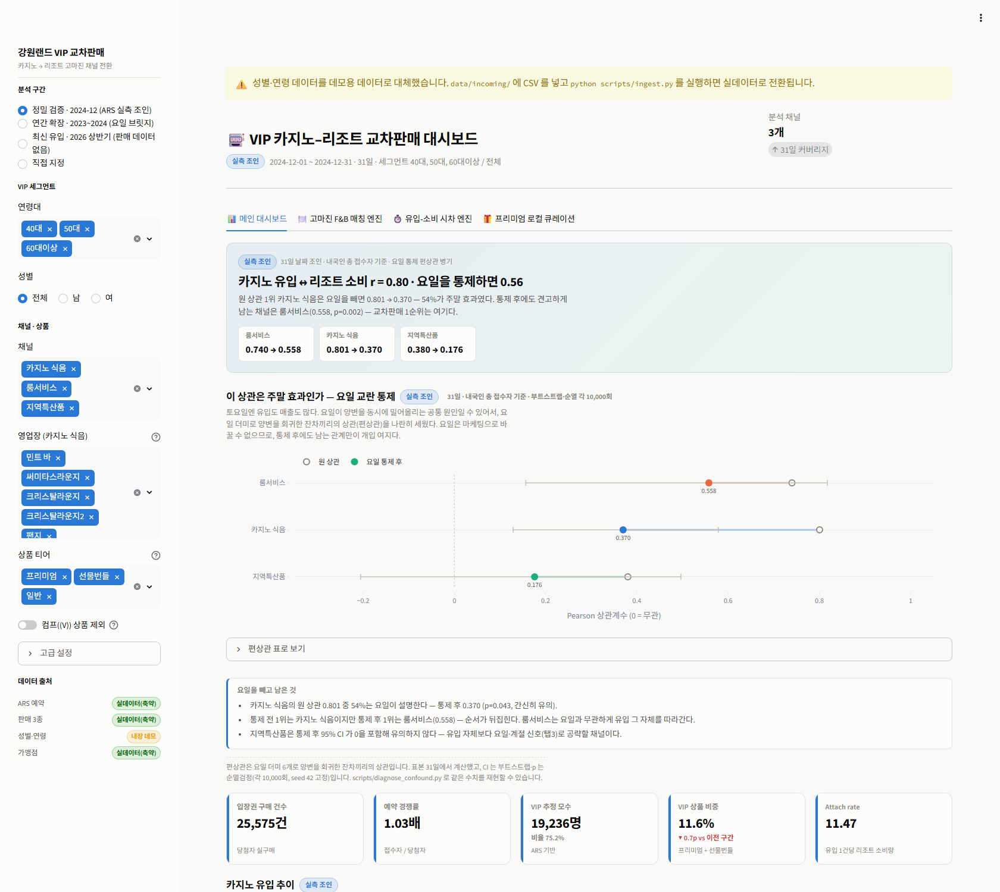
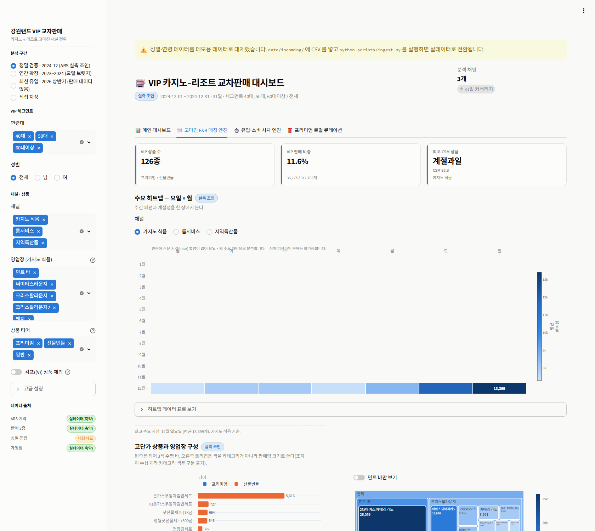
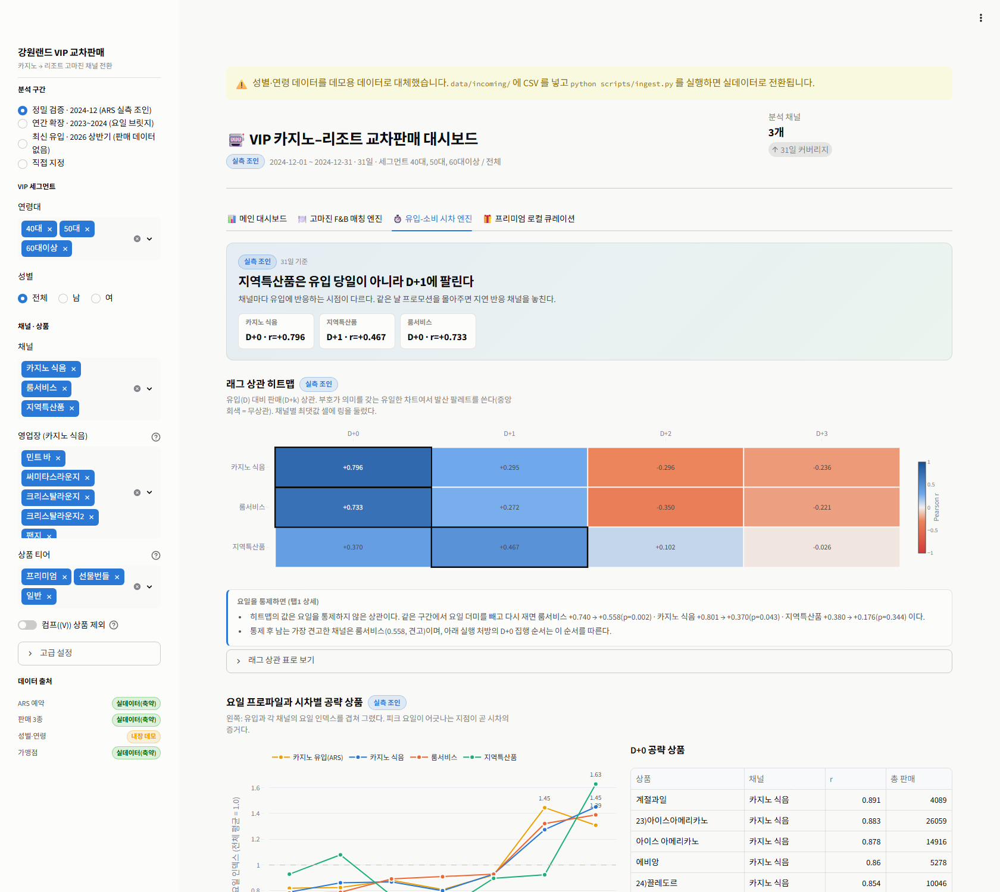
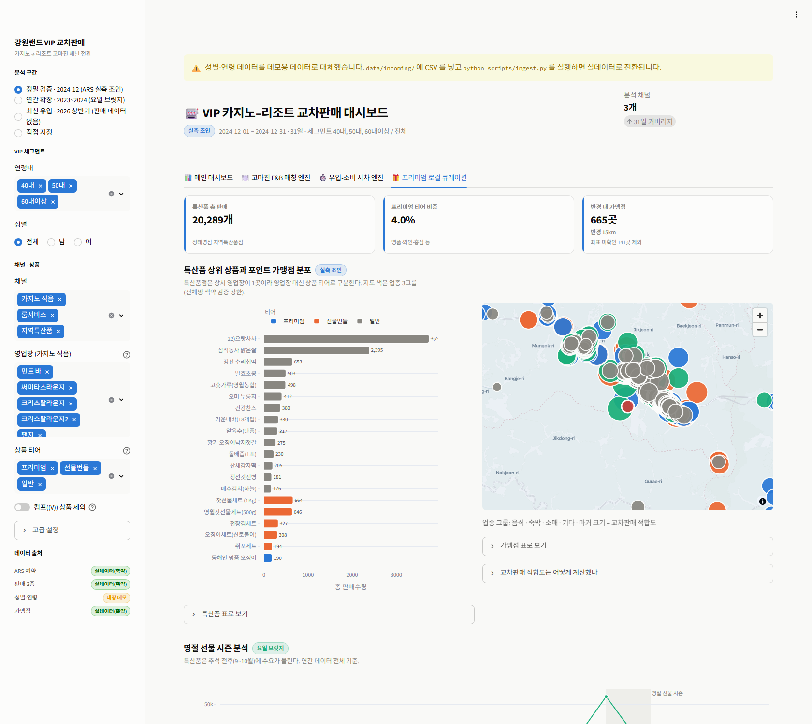
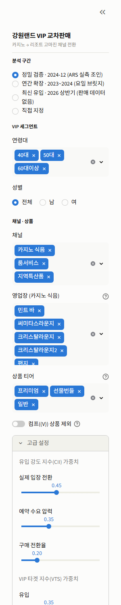

# 🎰 VIP 대상 카지노–리조트 통합 교차판매 마케팅 대시보드

> 카지노 유입 데이터와 리조트 POS 매출 데이터를 하나의 스코어링 체인으로 이어
> **"언제 · 누구에게 · 무엇을 제안할지"** 를 한 화면에서 판단하게 하는 마케팅 대시보드

**▶ 배포 URL — <https://kangwonland-vip-crosssell-2vubchckkyhe8ehii6hbiu.streamlit.app>**
접속 즉시 전체 기능이 조작 가능합니다. 로그인·회원가입·초기 설정 절차가 없습니다.



---

## 📌 산출물 정보

| 항목 | 내용 |
|---|---|
| **팀명** | 안성잘부 |
| **산출물명** | VIP 대상 카지노–리조트 통합 교차판매 마케팅 대시보드 |
| **한 줄 소개** | 카지노 유동 인구와 프리미엄 POS 매출 데이터를 결합하여 고마진 룸서비스 및 지역 특산품 교차 판매를 유도하는 마케팅 대시보드 |
| **저장소** | <https://github.com/KangwonVibeCoding/kangwonland-vip-crosssell> (Public) |
| **배포 URL** | <https://kangwonland-vip-crosssell-2vubchckkyhe8ehii6hbiu.streamlit.app> |
| **활용 데이터셋** | 내국인 입장권 ARS·모바일 예약현황 / 카지노 식음영업장 메뉴 판매현황 / 호텔 룸서비스 판매현황 / 하이원 지역특산품점 판매현황 / 고객성별연령분석현황 / 하이원포인트 가맹점 상세정보 / 하이원리조트 골프장 이용객 현황 (7종) |

---

## 🎯 무엇을 푸는가

강원랜드는 **카지노 유입**과 **리조트 내 소비**를 모두 공개하고 있지만, 데이터셋이
서로 분리되어 있어 마케팅 담당자가 두 흐름을 이어서 보지 못합니다.

이 대시보드는 다음 체인을 하나의 화면으로 잇습니다.

```
카지노 유입 강도  →  VIP 가용 모수  →  채널별 반응 시차  →  교차판매 대상 상품
    (CII/CAI)         (VRB)              (요일·래그)            (CSM · 큐레이션)
                          ↓
              VTS 상위 10일 = 캠페인 집행 캘린더
```

**검증한 가설**: *카지노로 유입된 고객의 소비력은 리조트 내 고마진 채널로 이어진다.*
→ **판매 전 기간 731일 실제 날짜 조인에서 r = 0.80, 요일을 통제한 뒤에도 0.617 로
남습니다** (p ≤ 0.001). 근거는 아래 [데이터가 말한 것](#-데이터가-말한-것)에 있습니다.

---

## 🔥 주요 기능

### 탭 1 · 메인 대시보드 — "오늘 어느 날을 공략할 것인가"


* **가설 검증 배너** — 채널별 상관을 *원 상관 → 요일 통제 편상관* 병기로 제시
* **요일 교란 통제 절** — 부트스트랩 95% CI · 순열검정 p · 견고성 판정을 화면에서 직접 계산
* KPI 5종 — 입장권 구매 건수 · 예약 경쟁률 · VIP 추정 모수 · VIP 상품 비중 · Attach rate
* 유입 추이 (x축 공유 2단: 건수 / 유입 지수, 정원 소진일 마커)
* **VTS 상위 10일 = 캠페인 집행 캘린더** — `유입 순위`·`유입만 봤다면 놓쳤을 날` 열 포함

### 탭 2 · 고마진 F&B 매칭 엔진 — "무엇을 제안할 것인가"



* **요일 × 월 수요 히트맵** (채널 전환) — 원본에 주문 시각이 없어 확정한 축
* VIP 고단가 상품 Top 15 (티어 3색) + 카지노 식음 영업장 트리맵
* **CSM 테이블** — Lift · 총 판매량 · 마진 프록시 · `근거` 열(측정됨 / 표본 부족)
* 룸서비스 × 지역특산품 **추천 번들 3종** (동시 상승일 근거 포함)

### 탭 3 · 유입–소비 시차 엔진 — "언제 집행할 것인가"



* **래그 상관 히트맵** — 채널 × D+0~D+3, 최적 시차 셀 링 강조 (발산 팔레트)
* ARS 유입 + 3채널 **요일 인덱스 4계열 비교** — 피크 요일 어긋남이 여기서 보입니다
* 상품 단위 최적 시차로 만든 **D+0 / D+1 공략 상품 그룹** (CSV 내려받기)
* **자동 생성 실행 처방 카드** — 집행 순서는 원 상관이 아니라 요일 통제 편상관을 따릅니다

### 탭 4 · 프리미엄 로컬 상생 큐레이션 — "지역과 어떻게 함께할 것인가"



* 지역특산품 Top 20 (티어별) + **하이원포인트 가맹점 지도** (pydeck, 업종 3그룹, 반경 필터)
* 명절 선물 시즌 분석 (9~10월 강조 — 특산품 9월 지수 1.43)
* **VIP 로컬 패키지 3종** — 큐레이션 상위 가맹점 × CSM 상위 특산품

### 공통 · 사이드바 필터



분석 구간(A/B/C·직접 지정) · VIP 세그먼트(연령·성별) · 채널/영업장/상품 티어 ·
컴프 상품 제외 · 지수 가중치 슬라이더 · 래그 최대 시차 · 가맹점 반경.
**모든 위젯에 유효한 기본값이 들어 있어 아무것도 고르지 않아도 첫 화면이 완성됩니다.**

---

## 📊 활용 강원랜드 공공데이터

| # | 데이터셋 | 형식 | 확보 기간 | 규모 | 사용 목적 |
|---|---|---|---|---|---|
| 1 | 내국인 입장권 ARS·모바일 예약현황 | CSV | 2023-01~2026-06 (2025-11 제외) | 1,247일 | 일별 유입 강도 (CII) |
| 2 | 카지노 식음영업장 메뉴 판매현황 | CSV | 2023~2024 (731일) | 179,287행 / 1,146종 | 객장 내 프리미엄 소비 · CAI |
| 3 | 호텔 룸서비스 판매현황 | CSV | 2023~2024 (731일) | 36,226행 / 250종 | VIP 고단가 메뉴 · 수요 패턴 |
| 4 | 하이원 지역특산품점 판매현황 | CSV | 2023~2024 (730일) | 69,353행 / 292종 | 명품 특산품 패키지 큐레이션 |
| 5 | 고객성별연령분석현황 | Open API | 2026-06-10~08-06 | 812행 | 고소비층(40~60대) VIP 모수 비율 |
| 6 | 하이원포인트 가맹점 상세정보 | Open API | — | 가맹점 목록 | 리조트 인근 프리미엄 사용처 지도 |
| 7 | 하이원리조트 골프장 이용객 현황 | CSV | 2021-03~2025-12 | 2,703행 | 고소비층 체류 신호 (데이터 계층만) |

* 판매 3종(2·3·4)은 스키마가 동일해 **단일 long 테이블 + `channel` 컬럼**으로 통합했습니다.
  합계 **284,866행 / 7,619,486개**입니다.
* **골프장(7)은 화면에 쓰지 않습니다.** 단위가 이용인원이라 판매수량과 합칠 수 없고
  기간도 어긋나, 채널로 섞으면 지표가 오염됩니다. 경계를 테스트로 고정해 두었습니다.
* **Open API 2종은 미리 내려받아 저장소에 포함**했습니다. 배포 환경에서 실시간 호출이
  실패해도 화면이 그대로 뜹니다 (아래 [배포 안전성](#-배포-안전성) 참조).

---

## ✅ 데이터가 말한 것

아래 수치는 모두 **원본 데이터를 직접 분석해 얻은 실측값**이며 `tests/test_stats.py` 에
회귀 기준으로 고정되어 있습니다. 전처리를 바꾸면 테스트가 즉시 깨집니다.
**같은 지표라도 창 길이에 따라 값이 다르므로 항상 창을 함께 적습니다.**

### 1. 유입과 소비는 실제로 함께 움직입니다 — 731일 날짜 조인

| ARS 유입 지표 | 카지노 식음 | 룸서비스 | 지역특산품 |
|---|---|---|---|
| 내국인 총 접수자 | **0.801** / 0.844 | **0.765** / 0.761 | 0.409 / 0.534 |
| 당첨자 입장권 구매 건수 | 0.761 / 0.811 | **0.779** / 0.826 | 0.313 / 0.422 |
| 당첨자 입장권 구매율 | 0.393 / 0.378 | 0.504 / 0.536 | 0.013 / 0.051 |
| VIP 상품만 (프리미엄+선물번들) | 0.742 | 0.674 | 0.397 |

*(Pearson / Spearman · n=731. 지역특산품만 n=730 — 2024-12-17 하루가 원본에 없습니다.)*

### 2. 요일 교란을 통제해도 관계가 남습니다

토요일엔 유입도 많고 매출도 많습니다. **요일이 양쪽을 동시에 밀어올리는 공통 원인**
이라면 "유입 → 소비" 서사가 흔들립니다. 그래서 요일 더미로 양변을 회귀한
**잔차끼리의 상관(편상관)** 을 계산했습니다.

| 채널 | 원 상관 | **요일 통제 후** | 95% CI | p (순열검정) | 판정 |
|---|---|---|---|---|---|
| 카지노 식음 | 0.801 | **0.617** | [0.543, 0.685] | ≤ 0.001 | 견고 |
| 룸서비스 | 0.765 | **0.596** | [0.518, 0.664] | ≤ 0.001 | 견고 |
| 지역특산품 | 0.409 | **0.214** | [0.142, 0.286] | ≤ 0.001 | 견고 |

*(n=731 · 부트스트랩·순열검정 각 10,000회 · seed 고정. **탭1이 같은 함수로 같은 표를
그립니다** — 문서와 화면이 다른 코드로 같은 수치를 만들지 않게 했습니다.)*

**요일이 설명하는 몫은 약 23% 이고, 나머지는 남습니다.** 요일은 마케팅으로 바꿀 수
없는 변수이므로, **통제 후에도 남는 관계**가 실제로 개입 여지가 있는 부분입니다.

### 3. 피크 요일이 채널마다 하루씩 어긋납니다

| 계열 (731일) | 월 | 화 | 수 | 목 | 금 | 토 | 일 |
|---|---|---|---|---|---|---|---|
| 카지노 유입 (입장권 구매 건수) | 0.85 | 0.85 | 0.85 | 0.85 | 0.96 | **1.38** | 1.25 |
| 카지노 식음 | 0.86 | 0.86 | 0.82 | 0.84 | 1.02 | **1.34** | 1.25 |
| 룸서비스 | 0.92 | 0.85 | 0.83 | 0.83 | 0.87 | 1.30 | **1.41** |
| 지역특산품 | 0.84 | 0.88 | 0.88 | 0.86 | 0.97 | 1.20 | **1.36** |

**유입과 카지노 식음은 토요일이 정점인데, 룸서비스와 지역특산품은 일요일이 정점입니다.**
*"주말에 들어와서 떠나는 날 선물을 산다"* 는 해석의 근거가 여기 있습니다.

### 4. 계절 피크도 채널마다 다릅니다 (2년 평균, 두 해 각각 재현)

| 채널 | 1월 | 2월 | 8월 | 9월 | 10월 | 12월 |
|---|---|---|---|---|---|---|
| 카지노 식음 | 1.02 | 1.07 | **1.10** | 1.02 | 0.99 | 1.02 |
| 룸서비스 | **1.21** | 1.16 | 1.00 | 0.90 | 0.91 | 1.03 |
| 지역특산품 | 1.04 | 1.04 | 1.02 | **1.43** | 1.03 | 0.99 |

지역특산품은 **추석(9월 1.43)**, 룸서비스는 **설·스키 성수기(1월 1.21)** 에 몰립니다.
1년치만 보면 "그 해에 이벤트가 있었다"와 구분되지 않지만, **2개년 독립 재현**이라
계절성이라 부를 수 있습니다 (`test_seasonality_repeats_across_years` 가 고정).

### 📣 그래서 실행 처방은

| 시점 | 채널 | 액션 | 근거 |
|---|---|---|---|
| **D+0** 유입 피크일 당일 | 카지노 식음 · 룸서비스 | 프리미엄 F&B + VIP 룸서비스 어메니티 | 편상관 0.617 / 0.596 (p ≤ 0.001, n=731) |
| **일요일** 체크아웃 동선 | 지역특산품 | 선물 패키지를 퇴실 동선에 배치 | 피크 요일 어긋남 (유입 토 1.38 vs 특산품 일 1.36) |
| **계절 오버레이** | 전 채널 | 9월 특산품 / 1월 룸서비스에 물량 집중 | 월 인덱스 1.43 / 1.21 (2개년 재현) |

---

## 📐 분석 지표

모든 지수는 `nrm`(robust 정규화) → `wsum`(가중합 0~100) → `grade`(등급화) 위에 쌓입니다.

| 지표 | 정의 | 핵심 설계 판단 |
|---|---|---|
| **CII** 유입 강도 | `0.45·n(입장권 구매 건수) + 0.35·n(총 접수자) + 0.20·n(구매율)` | `총 당첨자`는 일일 정원 캡(2,999)에 묶여 CV 0.178 로 사실상 상수 → **제외** |
| **CAI** 객장 활동 지수 | `0.60·n(카지노 식음 판매량) + 0.25·n(거래 건수) + 0.15·(ARS 요일 인덱스)` | ARS 없는 구간의 유입 프록시. 대체 타당성을 화면에 수치로 노출 — **CII 와 r = 0.904**(31일 중첩 구간) |
| **VRB** VIP 가용 모수 | `입장권 구매 건수 × vip_ratio × 성별 가중` | 성별·연령은 **비율만** 차용(실측 `vip_ratio` 0.666), 일별 규모는 ARS 에서 |
| **VTS** VIP 타겟 지수 | `0.35·n(유입) + 0.25·n(VRB) + 0.20·n(VIP 소비) + 0.20·headroom` | `headroom = 1 − n(attach)`. 유입만 보면 *이미 잘 파는 날*을 또 공략하게 됩니다. 모수 축이 유입과 중복이면 **자동으로 빠지고** 0.35 / 0.20 / 0.45 로 재편됩니다 |
| **CSM** 교차판매 매칭 | `0.45·n(log1p(lift)) + 0.30·n(총 판매량) + 0.25·(마진 프록시)` | `lift` = 고유입일 판매 비중 / 저유입일 판매 비중 |
| **CURATION** 가맹점 | `100 × (0.6·exp(−거리km/5) + 0.4·업종 프리미엄)` | 강원랜드 (37.2007, 128.8155) 기준 |

**마진 프록시** — 원본에 단가 컬럼이 없어 ⑴ 상품명 2티어(프리미엄 1.0 / 선물번들 0.7 /
일반 0.4), ⑵ 판매 희소도(+0.2), ⑶ 할인 비중(−0.1)을 결합합니다. **실제 마진율이 아니며**
화면에도 상시 캡션으로 밝힙니다.

<details>
<summary><b>지표를 이렇게 만든 이유 — 세 가지 방어 장치 (열어보기)</b></summary>

**① VTS 에서 VRB 축이 자동으로 빠집니다.** 성별·연령을 일자별로 붙일 수 없어
`vip_ratio` 가 상수이고, 따라서 `VRB = 입장권 구매 건수 × 상수` 입니다
(실측 corr = 0.9988). 두 축을 함께 쓰면 유입에 0.35 가 아니라 0.60 을 준 셈이 되어
이 지수의 존재 이유를 배반합니다. 빠진 0.25 는 균등 분배하지 않고 `headroom` 으로
넘깁니다 — 균등 재정규화하면 유입의 실효 비중이 오히려 커지기 때문입니다.
판정을 상관으로 하므로, **일자별 데이터가 들어오면 이 축은 자동 복구됩니다.**

**② lift 표본 요건이 창 길이·채널 스케일에 비례합니다.** '5일·10개' 같은 절대값은
731일 창에서 1,688종 중 1,534종을 통과시켜 게이트 구실을 못 하고, lift 가 24,027 까지
튑니다. 요건을 `max(5일, 창×20%)` · `max(10개, 채널 판매량 중앙값)` 으로 비례화한
뒤 lift 최댓값은 **4.5** 입니다. 몇 종을 왜 뺐는지 화면에 그대로 표기합니다.

**③ 표본 미달 상품에 점수 보너스를 주지 않습니다.** 정규화 기본 채움값 0.5 는
중립이 아닙니다 — 실측 탄력성 중앙값이 0.240(731일)이라 0.5 는 상위 18% 대우이고,
"측정하지 못했다"가 가산점이 됩니다. 그래서 **실측 분포의 중앙값**으로 채우고,
CSM 표에 `근거` 열(측정됨 / 표본 부족)을 답니다.

</details>

---

## 🕐 시간축 3구간 설계 — 기간 불일치를 정직하게 다루기

ARS(유입)와 판매 데이터의 **기간이 부분적으로만 겹칩니다.** 이를 얼버무리지 않고
구간을 명시적으로 나눠, **각 구간에서 할 수 있는 분석만** 수행합니다.

| 구간 | 기간 | 보유 데이터 | 가능한 분석 | UI 배지 |
|---|---|---|---|---|
| A. 정밀 검증 | 2024-12 (31일) | ARS + 판매 3종 | 좁은 창 대조용 | `31일 창` |
| **B. 실측 조인** | **2023~2024 (731일)** | **ARS + 판매 3종** | **상관·편상관·래그·lift (기본값)** | `실측 조인` |
| C. 최신 참조 | 2025~2026 상반기 | ARS | 최신 유입 트렌드 | `최신 유입` |

* **모든 차트에 구간 배지를 답니다.** 어느 근거로 그린 값인지 화면에 항상 드러내는
  것이 이 프로젝트의 신뢰 장치입니다.
* 구간 A 를 지우지 않은 이유는 **같은 코드가 창에 따라 다른 답을 내는 사례**를
  보여주기 위해서입니다. 앱에서 구간을 A 로 바꾸면 31일 창의 값이 그대로 재현됩니다.
* ARS 로더는 `data/raw/ars_*.csv` 를 **glob 으로 concat** 합니다. 파일을 추가로 넣으면
  **코드 수정 없이** 분석 구간이 넓어집니다.

---

## 🛡 배포 안전성

> 제출 안내문이 지적한 *"로컬에서는 되는데 배포하면 안 되는"* 실패 지점에 대한 대응입니다.

**① 데이터를 저장소에 포함했습니다.** API 실시간 호출에 의존하지 않습니다. Open API
2종을 미리 내려받아 `data/sample/` 축약본으로 커밋했고, **배포판은 이 실데이터로 뜹니다.**
인증키가 전혀 없어도 화면의 모든 수치가 실측값입니다.

**② 6계층 폴백 — 앱이 절대 죽지 않습니다.**

```
L1 data/processed/*.parquet  →  캐시된 전처리 결과
L2 data/raw/*.csv            →  ingest 산출물 (전체 실데이터)
L3 data/sample/*.parquet     →  축약본 (커밋 · 배포판이 쓰는 계층)
L4 Open API (data.go.kr)     →  실시간 + 디스크 캐시
L5 data/mock/*.csv           →  합성 데이터 (선택)
L6 src/data/fallback.py      →  코드 내장 상수 · 파일/네트워크 접근 0
```

각 단계는 개별 `try/except` 로 감싸여 있고 로더는 `(DataFrame, 출처)` 를 반환하며
**예외를 밖으로 던지지 않습니다.** L6 는 외부 I/O 가 전혀 없어 **절대 실패하지 않습니다**
— 데이터 파일이 하나도 없고 키도 없는 상태로 배포해도 앱이 정상 렌더됩니다.
현재 어느 계층이 쓰이는지는 **사이드바 하단 배지로 항상 노출**됩니다.
추가로 **탭 단위 예외 격리**가 있어 한 탭이 실패해도 나머지는 정상 동작합니다.

**③ 인증키는 저장소에 없습니다.** `.streamlit/secrets.toml` 은 `.gitignore` 대상이고,
배포 환경에서는 Streamlit Secrets(환경변수)로 주입합니다. 키가 없으면 조용히 폴백합니다.

**④ 자동 검증 151개.** `pytest tests/ -q` 전량 통과. 그중 `test_deploy_sample.py` 는
**`data/raw` 가 없는 상태를 흉내 내어** 커밋된 축약본만으로 핵심 실측값이 재현되는지
검사합니다 — 배포판이 조용히 내장 데모 데이터로 떨어지는 사고를 막는 장치입니다.

---

## 🛠 기술 스택 · 아키텍처

| 구분 | 사용 기술 |
|---|---|
| Frontend / Backend | Python 3.13 · Streamlit 1.60.0 |
| Data Processing | pandas 3.0.5 · NumPy 2.5.1 · PyArrow 24.0 (parquet 캐시) |
| Visualization | Plotly 6.9.0 · pydeck 0.9.3 (지도) |
| Deployment | Streamlit Community Cloud |

```
app.py                  오케스트레이션만 — 로드 → 필터 → 탭 렌더
├── config/settings.py  단일 설정 소스 (경로·컬럼맵·패턴·가중치·구간 정의)
├── scripts/ingest.py   원본 정규화: CP949 → UTF-8, 한글 파일명 → ASCII
├── src/data/           schema · loaders(6계층 폴백) · api_client · fallback
├── src/analysis/       stats · scoring · inflow · vip · crosssell · lag
│                       └ DataFrame in / out 순수 함수 (streamlit 미사용 → 테스트 가능)
├── src/ui/             theme · components · charts · maps · sidebar
├── src/views/          overview · fnb_engine · timing · local_curation
└── tests/              151개 — 실측값 회귀 · 렌더 · 배포 시뮬레이션
```

* **분석 계층이 streamlit 을 import 하지 않는 것**이 테스트를 가능하게 하는 전제입니다.
* 의존성은 **직접 의존 7개만 `==` 로 고정**했습니다. `pip freeze` 전체를 넣으면 Windows
  전용 패키지가 섞여 Linux 인 Cloud 빌드를 깨뜨립니다.
* 지도는 Folium 이 아니라 **pydeck** 입니다 — Streamlit 이 이미 의존하므로 추가 패키지가
  0개이고, 그만큼 배포 빌드 실패 리스크가 낮습니다.

---

## 💻 로컬 실행 방법

> 원본 CSV 는 저장소에 없지만(`.gitignore` 제외) 배포용 축약본이 커밋되어 있어
> **clone 후 바로 실행됩니다.** 아래 1·2·4번만 하면 실데이터 기준 화면이 그대로 뜹니다.

```powershell
# 1. 저장소 클론
git clone https://github.com/KangwonVibeCoding/kangwonland-vip-crosssell.git
cd kangwonland-vip-crosssell

# 2. 가상환경 + 의존성
python -m venv .venv
.\.venv\Scripts\Activate.ps1          # macOS/Linux: source .venv/bin/activate
pip install -r requirements.txt       # 테스트까지 돌리려면: -r requirements-dev.txt

# 3. (선택) API 키 — 없어도 앱은 실데이터로 정상 동작합니다
copy .streamlit\secrets.toml.example .streamlit\secrets.toml
#   → DATA_GO_KR_KEY 값을 발급받은 인증키(Decoding 키)로 교체

# 4. 실행
streamlit run app.py
```

한글 출력이 깨지면 `$env:PYTHONIOENCODING="utf-8"` 을 앞에 붙이세요 (콘솔 인코딩
문제이며 데이터는 정상입니다).

### 테스트

```powershell
pip install -r requirements-dev.txt     # pytest 는 여기에 있습니다
pytest tests\ -q                        # 전체 151개
pytest tests\test_stats.py -q           # 실측값 회귀만
pytest tests\test_deploy_sample.py -q   # 배포 환경 시뮬레이션
```

`test_stats.py` 는 원본 CSV(`data/raw/`)가 있어야 하며 없으면 skip 됩니다.

### 데이터 추가 배치

`data/incoming/` 에 공공데이터포털에서 받은 CSV 를 그대로 넣고
`python scripts/ingest.py` 를 실행하면 됩니다. **코드 수정이 필요 없습니다** —
`ingest.py` 는 파일명이 아니라 **파일 내용의 헤더 시그니처**로 데이터셋 종류를
판정하고(원본 파일명 규칙이 일관되지 않기 때문), CP949 를 UTF-8 로 변환한 뒤
ASCII 파일명으로 정규화하고 검증 리포트를 출력합니다.

| 디렉토리 | 내용 | git | 배포판 |
|---|---|---|---|
| `data/incoming/` | 원본 (한글 파일명, CP949) | 제외 | ✗ |
| `data/raw/` | ingest 산출물 (전체, UTF-8) | 제외 | ✗ |
| `data/sample/` | **실데이터 축약본** | **커밋** | ✓ |
| *(코드 내장)* | `fallback.py` 상수 | 커밋 | ✓ |

---

## ⚠️ 한계

확인한 제약을 숨기지 않고 기록합니다. **화면에도 동일한 캡션이 상시 노출됩니다.**

| 한계 | 대응 |
|---|---|
| **단가 컬럼 미제공** | 고마진은 상품명 티어 + 판매 희소도 기반 **프록시**. 실제 마진율이 아닙니다 |
| **주문 시각(hour) 컬럼 미제공** | 기획 초안의 "심야 피크타임 분석"은 구현 불가 → **요일 × 월 히트맵**으로 대체 |
| **성별·연령이 판매 기간과 겹치지 않음** | 보유분이 2026-06~08 뿐이라 판매(2023~2024)와 겹치는 날 0일. 게다가 원본이 누적 고객 수라 규모로 못 씁니다 → **비율만 차용**, 일별 규모는 ARS 에서 결합. 그래서 VTS 의 모수 축이 자동으로 빠집니다 |
| **`vip_ratio` 가 단일 출처** | 별도 공공데이터인 하이원멤버십 가입현황(회원 명부 469,645명)의 40~60대 비중 **0.671** 과 대조해 확인했습니다(방문객 집계 0.666). 서로 다른 모집단에서 같은 값입니다 |
| **좁은 창은 다른 답을 냅니다** | 31일 창에서 나왔던 "특산품 D+1 시차"는 731일 재검증에서 지지되지 않았습니다(D+0 0.313 > D+1 0.163, 두 해가 각각 D+0). **래그 주장은 철회하고 피크 요일 차이만 유지**합니다. 두 창을 앱에서 모두 볼 수 있게 남겨 두었습니다 |
| **특산품 2024-12-17 결측** | 730일 중 유일한 결측일. 0으로 채우지 않고 내부 조인으로 제외합니다(채우면 상관·요일지수가 왜곡됩니다) |
| **매월 1일 판매량 스파이크** | 카지노 식음 1.45배(2년 평균). 집계 아티팩트 의심 → robust 정규화(5~95분위) + 제외 토글 |
| **무상 제공 상품 약 6%** | `(V)` 접두 30,560개 + `무료` 포함 414,912개를 컴프로 분리하고 마진 0 처리 |
| **상관 ≠ 인과** | 요일은 통제했으나 연휴·프로모션 등 다른 공통 원인은 남습니다. 인과는 실험 설계로만 확인 가능합니다 |

**향후 과제** — ⑴ 판매 기간과 겹치는 일자별 성별·연령 확보 시 VTS 모수 축 자동 복구,
⑵ 단가 데이터 확보 시 마진 프록시를 실제 마진으로 교체, ⑶ 실제 캠페인 A/B 결과를
피드백해 VTS 가중치 보정.

---

## 📄 라이선스 / 데이터 이용조건

* 활용 데이터: [공공데이터포털](https://www.data.go.kr) (주)강원랜드 개방 데이터
* 데이터 이용조건은 각 데이터셋의 공공데이터포털 이용허락범위를 따릅니다.
* 본 대시보드의 분석 결과는 공개 데이터에 기반한 추정이며, 강원랜드의 공식 견해가 아닙니다.
